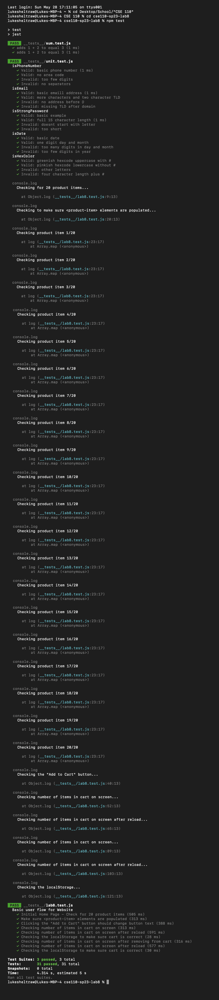

# Lab 8
Name: Luke Sheltraw (no partner)

## Questions

1. Where would you fit your automated tests in your Recipe project development pipeline? Select one of the following and explain why.

	- Within a Github action that runs whenever code is pushed 
	- Manually run them locally before pushing code
	- Run them all after all development is completed

	**Answer**: If we could only pick one of the options, it would be to fit the tests into a GitHub action that runs whenever code is pushed. This method allows us to create a consistent and fully automatic testing system, and mitigates the risk of bad code ever actually reaching production (i.e. we could also halt the build pipeline if tests fail, no matter what). Furthermore, it provides the developers constant updates on the current functionality of their code. However, practically speaking, there is no reason to not do all three of the options. Of course, as before, we want to test whenever new code is pushed—but it also makes sense to test that code even before we push it (as running tests locally is usually faster than waiting for the VM to spin up), to avoid cycles of pushing, waiting for results, fixing bugs, pushing, waiting for results, etc. Furthermore, it makes sense to run a series of tests after development is finished just to ensure the product is fully functional before deployment. That is, running tests whenever code is pushed is probably the best of these three options, but there is no reason to limit ourselves to just one method of testing: it never hurts to test more.

2. Would you use an end to end test to check if a function is returning the correct output? 

	**Answer**: No; checking specific functions' outputs is the purpose of unit testing. E2E testing may implicitly check these things too, but it's not the main purpose.

3. Would you use a unit test to test the “message” feature of a messaging application? Why or why not? For this question, assume the “message” feature allows a user to write and send a message to another user.

	**Answer**: No; there is too much complexity here to be fully encapsulated in a unit test. This should be tested during E2E testing. This feature could be considered to have at least three large parts (user entering message, message transmission, user recieving message), and each of those parts could be broken down into many smaller parts (text input, text validation, text appearance, etc). Unit tests are meant to test a small part of a program (i.e. a single function call), not a massive feature all at once.

4. Would you use a unit test to test the “max message length” feature of a messaging application? Why or why not? For this question, assume the “max message length” feature prevents the user from typing more than 80 characters.

	**Answer**: Yes; this feature is small (i.e. a single unit) and likely implemented in a single function attached to an event listener (e.g. user input). If we were to test this function in isolation (as unit testing does), we could be reasonably certain that the feature works as intended. Furthermore, the intended behavior is very easily understood through function calls. That is, we could perform unit testing by testing a range of message lengths, and ensuring the function clamps all the messages to at most 80 characters.
	
## Test Results

